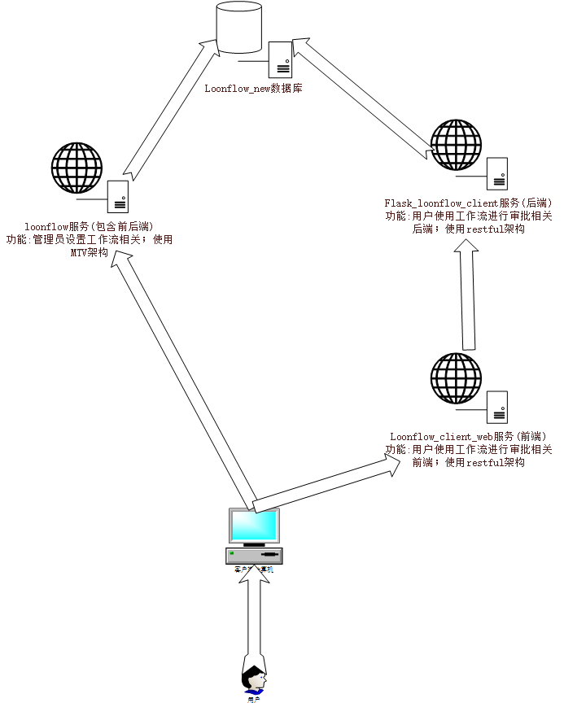

# loonflow_custom
loonflow项目 修改版;此项目为 工作流的 后端管理系统，包括用户管理，工作流配置等;

# 声明
此项目为 [loonflow(工作流)](https://github.com/blackholll/loonflow) 基础上进行修改
感谢 前人的辛苦开源，让我们拥有美好的明天!

### 源项目 获取时的最后上传时间为 2019.11.24

# 修改原因
* 由于原项目的 用户模块 数据是通过 直接sql转换方式 导入数据，不够方便，所以增加了 导入用户相关数据的api

# 修改内容(修改点 加了 rgc 开头的注释)
* 增加 导入用户相关数据api
* 修改 获取username方式(弱化 入参校验);service/permission/api_permission.py
* 修改代码格式

# 配合的项目为
flask_loonflow_client,loonflow_client_web

# 启动项目方法
#### 启动 django服务
* 新建数据库 名为 loonflownew
* 导入 项目根目录的 loonflownew.sql 数据
* pip install -r xxx/loonflow_custom/requirements/common.txt -i https://pypi.tuna.tsinghua.edu.cn/simple/
* python manage.py runserver 6060

#### 启动 celery服务
* 进入项目根目录
* 非windows系统:celery -A tasks worker -l info -Q loonflow
* windows系统(先安装eventlet):celery -A tasks worker -l info -Q loonflow -P eventlet

### 其他相关readme内容
* 请查看 [loonflow_readme](https://github.com/blackholll/loonflow)
* 请查看 [loonflow_wiki](https://github.com/blackholll/loonflow/wiki/latest)

# 备注注意点
* 工作流 在定义 状态 时，如果 参与人类型 为 脚本，则必须 有一个后续 状态，并且能够流转到后续状态；
* 多人审核时(如 部门,角色) 在定义状态时，请选择 直接处理，否则报错

# 项目依赖关系架构图
 
 